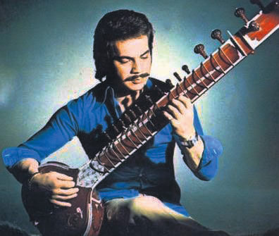

```{r setup, include=FALSE}
library(flexdashboard)
library(tidyverse)
library(spotifyr)
library(ggplot2)
library(showtext)
library(plotly)
library(compmus)

# getting access to the spotify API
Sys.setenv(SPOTIFY_CLIENT_ID = 'c165e1d0717c4bc1a4b10fad65d016e5')
Sys.setenv(SPOTIFY_CLIENT_SECRET = '7771634e58dd4c379280db7d30afbf25')

access_token <- get_spotify_access_token()

font_add_google("Inter", "Inter")
showtext_auto()

# retrieving the audio features of my corpus
baba <- get_playlist_audio_features("", "37i9dQZF1DX9azIhpBmNbd")
eski <- get_playlist_audio_features("", "12VU80QKYGednqNghHrWNW")
beskr <- get_playlist_audio_features("", "37i9dQZF1DXciCKvzkUxfS")
beskp <- get_playlist_audio_features("", "37i9dQZF1DXduWUvte9ZYi?")

# merging the playlists and other preprocessing
eski <- mutate(eski, playlist_name = "Arabesk")
baba <- mutate(baba, playlist_name = "Arabesk")
old <- merge(eski, baba, all = TRUE)
merged <- merge(beskr, beskp, all = TRUE)
merged <- merge(merged, baba, all = TRUE)
merged <- merge(merged, eski, all = TRUE)
merged <- merged[,!names(merged) %in% c('playlist_img','playlist_owner_name',
                                        'playlist_owner_id','playlist_id',
                                        'track.id','added_at',
                                        'primary_color','added_by.id',
                                        'added_by.type','added_by.uri',
                                        'added_by.href','added_by.external_urls.spotify',
                                        'track.artists','track.disc_number',
                                        'track.episode','track.is_local',
                                        'is_local','track.href',
                                        'track.preview_url','video_thumbnail.url',
                                        'track.album.type','track.album.uri',
                                        'track.external_ids.isrc','track.external_urls.spotify',
                                        'track.album.external_urls.spotify','track.uri',
                                        'track.track','track.type',
                                        'track.album.href','track.album.id',
                                        'track.album.images','track.album.total_tracks',
                                        'track.track_number','track.available_markets',
                                        'track.album.available_markets')]
knitr::opts_chunk$set(echo = TRUE)
```

Corpus
=========================================================

### A description of my corpus

My corpus consists of playlists made by Spotify that revolve around the Arabesk music genre. Arabesk is a popular Turkish music genre that emerged in the 1960s and blends traditional Turkish music with elements of Middle Eastern and Southeast European music.The first playlist consists of Arabesk music that is considered more old-school and classic. It's titled 'Babalar'.The second and third playlists are of subgenres of Arabesk music that emerged decades after Arabesk music arrived. The genres are Arabesk pop and Arabesk rap. Their respective playlists are "Besk Pop" and "Besk Rap".

I chose this corpus, because I don't know enough about this genre and want to learn more. What's interesting about Arabesk is that it has changed tremendously throughout the years.

My main interest of points are to compare are how the chosen subgenres are similar or different to classic Arabesk music. It could also be interesting to see the differences between songs from each decade.

I believe that the playlists cover their genres fairly well, as Spotify has created them with the purpose of doing so. A strength would be the variety in artists that are featured in the playlists. A weakness could be the size of the corpus.

A typical Arabesk track could be Unutamadım (Kaç Kadeh Kırıldı) by Müslüm Gürses, due to the melancholic tone of the song. A track that could be quite atypical might be Alev Alev by Hayat, as part of it is in German and does not share the typical sentiment of older Arabesk songs. Thus, it makes sense for it to be in the Besk rap playlist. Do remember that these playlists can change from time to time, as Spotify might adjust the songs that are used in them. In particular the subgenres are more likely to change, as they have a focus on newer music.

As of March 5th 2023, a fourth playlist that consists of more songs was added to the corpus. This playlist has been added with the intent of increasing the amount of older Arabesk music. I wanted to increase the representation of different artists and songs in my corpus. So far it has not affected my results much, so I'm not sure if it was helpful. The playlist was mostly made by someone else, but I added a bit to it myself.

In the end, I made the decision to view my corpus from two perspectives. The first being a wider perspective in which I compare the Arabesk genre to the subgenres. The latter being a narrower perspective in which I zoom in on a specific artist in the Arabesk genre. I made visualisations and analyses of both perspectives.

<iframe style="border-radius:12px" src="https://open.spotify.com/embed/playlist/37i9dQZF1DX9azIhpBmNbd?utm_source=generator&amp;theme=0" width="100%" height="176" frameBorder="0" allowfullscreen allow="autoplay; clipboard-write; encrypted-media; fullscreen; picture-in-picture" loading="lazy">

</iframe>

<iframe style="border-radius:12px" src="https://open.spotify.com/embed/playlist/12VU80QKYGednqNghHrWNW?utm_source=generator&amp;theme=0" width="100%" height="176" frameBorder="0" allowfullscreen allow="autoplay; clipboard-write; encrypted-media; fullscreen; picture-in-picture" loading="lazy">

</iframe>

<iframe style="border-radius:12px" src="https://open.spotify.com/embed/playlist/37i9dQZF1DXduWUvte9ZYi?utm_source=generator&amp;theme=0" width="100%" height="176" frameBorder="0" allowfullscreen allow="autoplay; clipboard-write; encrypted-media; fullscreen; picture-in-picture" loading="lazy">

</iframe>

<iframe style="border-radius:12px" src="https://open.spotify.com/embed/playlist/37i9dQZF1DXciCKvzkUxfS?utm_source=generator&amp;theme=0" width="100%" height="176" frameBorder="0" allowfullscreen allow="autoplay; clipboard-write; encrypted-media; fullscreen; picture-in-picture" loading="lazy">

</iframe>

# Introduction to the genres {data-navmenu="Genres"}

## Column {data-width="700"}

### Background information

***
* [Arabesk](https://en.wikipedia.org/wiki/Arabesque_(Turkish_music)) is a popular Turkish music genre that emerged in the 1960s and  blends traditional Turkish music with elements of Middle Eastern and Southeast European music. The music often expresses grief, pain or non-mutual love. Arabesk music has been pretty popular since it emerged and also had a big cultural influence. There are a lot of artists and subgenres that are inspired by the Arabesk music genre. In this part of my portfolio, I will take a look at Arabesk music in comparison to some of the subgenres that came from it. The subgenres that I will use in my portfolio are Arabesk rap and Arabesk pop. As the names imply, they are genres that combine the Arabesk genre with rap and pop. Personally, I am more inclined to listen to older Arabesk music than the subgenres. It also sounds very different to me than the subgenres. Through my visualisations, I hope to make some analyses which might explain why I experience these genres differently. If you're interested in reading more about Arabesk in relation to Turkish politics or culture, [this](https://www.tandfonline.com/doi/abs/10.1080/09502380701480402) could be an interesting read for you.

<iframe style="border-radius:12px" src="https://open.spotify.com/embed/artist/52S9QMQQA2k0LjtELttOVQ?utm_source=generator&theme=0" width="100%" height="352" frameBorder="0" allowfullscreen="" allow="autoplay; clipboard-write; encrypted-media; fullscreen; picture-in-picture" loading="lazy"></iframe>

## Column {data-width="300"}

### Image
***
* 

* Orhan Gencebay is considered to be a pioneer in the Arabesk genre. I won't mention him a lot in the rest of my portfolio, but it felt right to at least have an image of him in my project.

# Acousticness and Danceability {data-navmenu="Genres"}

## Column {data-width="700"}

### Visualising acousticness and danceability in the corpus

```{r echo=FALSE}
scatter <- ggplot(merged, aes(danceability, acousticness)) +
  geom_point() +
  # geom_smooth() +
  coord_cartesian(ylim = c(0,1), xlim = c(0,1)) +
  theme_bw() +
  theme(
    text = element_text(family = "Inter"),
    panel.grid.major = element_blank(),
    panel.grid.minor = element_blank()) +
  labs(x = "Danceability", y = "Acousticness", title = "Classic Arabesk is more acoustic and less danceable than the subgenres") +
  facet_wrap(~playlist_name)

ggplotly(scatter)
```

## Column {data-width="300"}
***
* The scatter plot above plots the acousticness of the playlists on the Y-axis and the danceability of the playlists on the X-axis. This is done in three subplots for each of the playlists. When looking at the pattern of the dots, it becomes clear that classic Arabesk music tends to have a lower danceability rating and a higher acousticness rating in comparison to the two subgenres (Arabesk Pop and Arabesk Rap). This shows some of the differences of the more recent music in the subgenres in comparison to the older music.

* I would assume that these different patterns in acousticness and danceability could certainly be a reason for a different experience when listening to the subgenres in comparison to the original Arabesk genre. Partially, I feel like this could be due to the era in which the music came out. My assumption is that older music in general is more acoustic and less danceable than music released in the past years. So personally, I am not sure if these differences are unique to Arabesk and its subgenres, despite that they probably do play a role in the different experience when listening to the subgenres.


# Valence {data-navmenu="Genres"}

## Column {data-width="700"}


### Mean Valences

```{r echo=FALSE}
val <- merged %>%
  group_by(playlist_name) %>%
  summarize(mean_valence = mean(valence)) %>%
  ggplot(aes(playlist_name, mean_valence, fill = playlist_name)) +
    geom_col() +
    geom_text(aes(label=round(mean_valence, 2)), vjust = -0.5) +
    coord_cartesian(ylim = c(0,1)) +
    labs(x = "Playlist", y = " Mean valence", title = "The difference in the valence of the playlists is small") +
    theme_bw() + 
    theme( text = element_text(family = "Inter"),
           legend.position = 'none',
           panel.grid.major = element_blank(),
           panel.grid.minor = element_blank()) +
    scale_y_continuous(breaks=seq(0,1,1))

ggplotly(val, tooltip = "text")
```

### Boxplot

```{r echo=FALSE}
boxx <- plot_ly(y = merged$playlist_name, x = merged$valence, type = "box", color = ~merged$playlist_name)
boxx <- boxx %>% layout(title = "The valence of the playlist does not differ greatly", xaxis = list(title="Valence"), yaxis = list(showticklabels=FALSE))

boxx
```


## Column {data-width="300"}

***
* The first plot shows the mean valence for each of the playlists used. The difference between the values are actually much smaller than I expected them to be. Prior to this plot, I would have expected the classic Arabesk playlist (Babalar) to have somewhat of a lower valence than the other two playlists, as Arabesk music is well known in Turkey for being music that would be of low valence. Perhaps the mean was not the best property to take of the valence feature, due to its sensitivity to outliers.

* The second plot tries to mitigate how susceptible the mean is to outliers by being a boxplot instead. Despite seeing some differences between the values of the first quartile, I don't notice differences in the valence, that would be as significant as I expected. Even though, the results of these visualisations don't seem to say much, to me this is very valuable. They falsify an initial belief that I had. The valence of the songs in the subgenres clearly are not necessarily higher than older Arabesk music. I'd be interested in learning more about this in the future.


# Popularity {data-navmenu="Genres"}

## Column {data-width="700"}

### Boxplot
```{r echo=FALSE}
fig <- plot_ly(y = merged$playlist_name, x = merged$track.popularity, type = "box", color = ~merged$playlist_name)
fig <- fig %>% layout(title = "Older Arabesk music currently is less popular than the subgenres", xaxis = list(title="Track popularity"), yaxis = list(showticklabels=FALSE))

fig
```


## Column {data-width="300"}
***
* In this plot it the popularity of the tracks in each playlist are used to create boxplots. When comparing the boxplots, it becomes clear that these days the tracks from the older playlist are less popular than the subgenres which consists of newer music. Partially this makes sense, as newer music might be more relevant and perhaps is made to fit an audience of this era. However, I would have expected the "Babalar" playlist to be a bit more popular, because it contains music from artists that are highly respected in Turkey (Such as Müslüm Gürses, Orhan Gencebay and Ferdi Tayfur).

* One important thing to note is that the people who enjoy the music from the older Arabesk playlist, might not necessarily all listen to them on Spotify. Like I have said often now, that music is older than its subgenres. It's very possible that older people who listen to this music, might still do so through cassettes or CD's. We also have to question how many people who listened to Arabesk music in the '70s, '80s or '90s, still listen to that music today. 30 or more years is a quite a long time and a lot can happen in that timeframe.

# Introduction to Müslüm Gürses {data-navmenu="Müslüm"}

## Column {data-width="700"}

### Background information

***
* [Müslüm Gürses](https://en.wikipedia.org/wiki/M%C3%BCsl%C3%BCm_G%C3%BCrses) was a legendary Turkish musician and singer, who still is widely accepted as one of the most successful Turkish artists of all time. He started being active in music in the seventies and remained active until his death in 2013. He rose to fame with his distinctive voice and emotional delivery. To me, Müslüm Gürses is the first artist that I think about when I think of the Arabesk genre. This is why, I decided to analyse some of his music in my portfolio. The goal of these analyses is to come across interesting findings about indivual songs or the discography of this artist. Müslüm is a very interesting artist and I think that there are more interesting insights to find about him outside of the scope of my portfolio. If you would like to know more about Müslüm, there is a good [film](https://www.imdb.com/title/tt7832124/) about his life.

<iframe style="border-radius:12px" src="https://open.spotify.com/embed/artist/4cMwyqmHCwJjRZ3frIVHTr?utm_source=generator&theme=0" width="100%" height="352" frameBorder="0" allowfullscreen="" allow="autoplay; clipboard-write; encrypted-media; fullscreen; picture-in-picture" loading="lazy"></iframe>

## Column {data-width="300"}

### Image


# Nilüfer {data-navmenu="Müslüm"}


## Column {data-width="700"}

### Distance matrix


### Self similarity matrix
```{r echo=FALSE}
muslum2 <-
  get_tidy_audio_analysis("4cHrCNJTdMfbtY0fjc5ged") |> # Change URI.
  compmus_align(bars, segments) |>                     # Change `bars`
  select(bars) |>                                      #   in all three
  unnest(bars) |>                                      #   of these lines.
  mutate(
    pitches =
      map(segments,
          compmus_summarise, pitches,
          method = "rms", norm = "euclidean"              # Change summary & norm.
      )
  ) |>
  mutate(
    timbre =
      map(segments,
          compmus_summarise, timbre,
          method = "rms", norm = "euclidean"              # Change summary & norm.
      )
  )
timb <- muslum2 |>
  compmus_self_similarity(timbre, "cosine") |> 
  ggplot(
    aes(
      x = xstart + xduration / 2,
      width = xduration,
      y = ystart + yduration / 2,
      height = yduration,
      fill = d
    )
  ) +
  geom_tile() +
  coord_fixed() +
  scale_fill_viridis_c(guide = "none") +
  theme_classic() +
  labs(title = "Self similarity Matrix of the timbre of Müslüm\'s Nilüfer") +
  labs(x = "", y = "")

ggplotly(timb)
```
## Column {data-width="300"}
***

* In the first plot we see a distance matrix of the pitches of the song "Nilüfer", performed originally by Müslüm Gürses in 2006. 15 years later, Rock band Gripin released their own version of this song. Even though, Gripin's variant of this song is not in my corpus, I felt like it would be interesting to make this distance matrix between these two recordings. Müslüm Gürses is one of the biggest names in the Arabesk genre and his song "Nilüfer" is one of his biggest hits, despite it being one of his later releases. Personally, I listen to the original more often than I listen to Gripin's verison, but I do not mind Gripin's version of the song either. Other interesting distance matrices could be made with other songs that came from the 2006 album "Aşk Tesadüfleri Sever", as it contains a lot of songs of which instrumentals are taken from popular non-Turkish music. Nilüfer is not one of those songs. 

* Now to get to my actual analysis of the matrix, I struggle to see a cost-minimizing alignment path that could be created through dynamic time warping. This could be a fun task to eventually attempt, but when the matrix looks as chaotic as it does, it might be very difficult to do so. Initially, I expected the songs to have some differences in their pitches, but I'm not entirely sure if my matrix confirms or denies this. One thing that's clear is that both versions of Nilüfer are actually quite different in a lot of ways. Despite Gripin's version being their own twist on this song, structurally the matrix shows that they differ a lot as well.

* In the second plot a self similarity matrix of the timbre of Müslüm's Nilüfer can be seen. Generally, to me it seems like the distances between timbre at different moments are not very large. This would suggest that this song in particular has some clear structure to it. In the future, an interesting idea could be to make chroma-based self similarity matrix too, to see if we could find clear structures in the song there too.

Seni Yazdım {data-navmenu="Müslüm"}
=========================================================

## Column {data-width="700"}

### Chordogram

```{r echo=FALSE}
circshift <- function(v, n) {
  if (n == 0) v else c(tail(v, n), head(v, -n))
}

#      C     C#    D     Eb    E     F     F#    G     Ab    A     Bb    B
major_chord <-
  c(   1,    0,    0,    0,    1,    0,    0,    1,    0,    0,    0,    0)
minor_chord <-
  c(   1,    0,    0,    1,    0,    0,    0,    1,    0,    0,    0,    0)
seventh_chord <-
  c(   1,    0,    0,    0,    1,    0,    0,    1,    0,    0,    1,    0)

major_key <-
  c(6.35, 2.23, 3.48, 2.33, 4.38, 4.09, 2.52, 5.19, 2.39, 3.66, 2.29, 2.88)
minor_key <-
  c(6.33, 2.68, 3.52, 5.38, 2.60, 3.53, 2.54, 4.75, 3.98, 2.69, 3.34, 3.17)

chord_templates <-
  tribble(
    ~name, ~template,
    "Gb:7", circshift(seventh_chord, 6),
    "Gb:maj", circshift(major_chord, 6),
    "Bb:min", circshift(minor_chord, 10),
    "Db:maj", circshift(major_chord, 1),
    "F:min", circshift(minor_chord, 5),
    "Ab:7", circshift(seventh_chord, 8),
    "Ab:maj", circshift(major_chord, 8),
    "C:min", circshift(minor_chord, 0),
    "Eb:7", circshift(seventh_chord, 3),
    "Eb:maj", circshift(major_chord, 3),
    "G:min", circshift(minor_chord, 7),
    "Bb:7", circshift(seventh_chord, 10),
    "Bb:maj", circshift(major_chord, 10),
    "D:min", circshift(minor_chord, 2),
    "F:7", circshift(seventh_chord, 5),
    "F:maj", circshift(major_chord, 5),
    "A:min", circshift(minor_chord, 9),
    "C:7", circshift(seventh_chord, 0),
    "C:maj", circshift(major_chord, 0),
    "E:min", circshift(minor_chord, 4),
    "G:7", circshift(seventh_chord, 7),
    "G:maj", circshift(major_chord, 7),
    "B:min", circshift(minor_chord, 11),
    "D:7", circshift(seventh_chord, 2),
    "D:maj", circshift(major_chord, 2),
    "F#:min", circshift(minor_chord, 6),
    "A:7", circshift(seventh_chord, 9),
    "A:maj", circshift(major_chord, 9),
    "C#:min", circshift(minor_chord, 1),
    "E:7", circshift(seventh_chord, 4),
    "E:maj", circshift(major_chord, 4),
    "G#:min", circshift(minor_chord, 8),
    "B:7", circshift(seventh_chord, 11),
    "B:maj", circshift(major_chord, 11),
    "D#:min", circshift(minor_chord, 3)
  )

key_templates <-
  tribble(
    ~name, ~template,
    "Gb:maj", circshift(major_key, 6),
    "Bb:min", circshift(minor_key, 10),
    "Db:maj", circshift(major_key, 1),
    "F:min", circshift(minor_key, 5),
    "Ab:maj", circshift(major_key, 8),
    "C:min", circshift(minor_key, 0),
    "Eb:maj", circshift(major_key, 3),
    "G:min", circshift(minor_key, 7),
    "Bb:maj", circshift(major_key, 10),
    "D:min", circshift(minor_key, 2),
    "F:maj", circshift(major_key, 5),
    "A:min", circshift(minor_key, 9),
    "C:maj", circshift(major_key, 0),
    "E:min", circshift(minor_key, 4),
    "G:maj", circshift(major_key, 7),
    "B:min", circshift(minor_key, 11),
    "D:maj", circshift(major_key, 2),
    "F#:min", circshift(minor_key, 6),
    "A:maj", circshift(major_key, 9),
    "C#:min", circshift(minor_key, 1),
    "E:maj", circshift(major_key, 4),
    "G#:min", circshift(minor_key, 8),
    "B:maj", circshift(major_key, 11),
    "D#:min", circshift(minor_key, 3)
  )

haydi <-
  get_tidy_audio_analysis("3XTzXWtABSuYqAvOso5YP9") |>
  compmus_align(sections, segments) |>
  select(sections) |>
  unnest(sections) |>
  mutate(
    pitches =
      map(segments,
          compmus_summarise, pitches,
          method = "mean", norm = "manhattan"
      )
  )

haydi2 <- haydi |> 
  compmus_match_pitch_template(
    chord_templates,         # Change to chord_templates if descired
    method = "euclidean",  # Try different distance metrics
    norm = "manhattan"     # Try different norms
  ) |>
  ggplot(
    aes(x = start + duration / 2, width = duration, y = name, fill = d)
  ) +
  geom_tile() +
  scale_fill_viridis_c(guide = "none") +
  theme_minimal() +
  labs(x = "Time (s)", y = "", title = "Chordogram of Seni Yazdım")
ggplotly(haydi2)
```


## Column {data-width="300"}
***
* Continuing with iconic songs of Müslüm Gürses, this week I made a chordogram of his song 'Seni Yazdım'. Just like Nilüfer, Seni Yazdım is one of Müslüm's biggest hits. However, in contrast to Nilüfer, Seni Yazdım might be more a of a typical arabesk song. First I looked at the keys of the song, but then came to the conclusion that a chordogram gave me more valuable insights about how the song is structured.

* In the graph, the magnitude of a chord is higher when it is more blue instead of yellow. Knowing this, it becomes clear that the most prominent chords in the song are 7th chords. Personally, I think that Seni Yazdım is a song that stands out in Müslüm's discography. It has a unique sound, whilst still staying close to the Arabesk genre. This may be due to the 7th chords, which might add some color and richness to the harmonies, but could also be used to create tension if the chord is dominant. When I listen to the song, I get the feeling that the chords fulfill both of those purposes. That tension in particular is something that I feel right before the chorus. Despite all of this, the most important use of these chords is to convey the emotions that the artist feels. The lyrics convey that there is some person that the artist loved and does not see anymore. That also fits traditional Arabesk music very well. The chords are used to complement these lyrics and subjectively, I think it really works.

<iframe style="border-radius:12px" src="https://open.spotify.com/embed/track/3XTzXWtABSuYqAvOso5YP9?utm_source=generator&theme=0" width="100%" height="352" frameBorder="0" allowfullscreen="" allow="autoplay; clipboard-write; encrypted-media; fullscreen; picture-in-picture" loading="lazy"></iframe>

Tempo {data-navmenu="Genres"}
=========================================================

## Column {data-width="700"}

### Tempo histogram

```{r echo=FALSE}
templot2 <- subplot(plot_ly(x = old$tempo, type = "histogram", histnorm = "probability",nbinsx = (max(old$tempo) - min(old$tempo))/10, xbins = list(size = 10), name = "Arabesk"),
                    plot_ly(x = beskp$tempo, type = "histogram", histnorm = "probability",nbinsx = (max(beskp$tempo) - min(beskp$tempo))/10, xbins = list(size = 10), name = "Besk Pop"),
                    plot_ly(x = beskr$tempo, type = "histogram", histnorm = "probability",nbinsx = (max(beskr$tempo) - min(beskr$tempo))/10, xbins = list(size = 10), name = "Besk Rap")
                    ) %>% 
  layout(title = "Tempo proportions of Arabesk music and its subgenres")

templot2
```


## Column {data-width="300"}
***
* A reason why traditional Arabesk music sounds a bit different than Besk Pop and Besk Rap to me, could partially be due to differences in the tempo of the songs. In order to check whether my intuition was correct or not, I decided to make histograms of the tempi of each genre. The Y-axis of the histograms represents the proportion of songs in my corpus of that genre that have a certain BPM range, rather than the amount of occurrences of each range of tempo in their respective genre. To elaborate, if a BPM range of 90 to 100 is mapped to a value of 0.1 on the Y-axis, this means that about 10% of the songs in my corpus of that genre have a BPM range of 90 to 100.

* Looking at this histogram, it becomes clear that the mode in each histogram is the same. This is a BPM in between 90 and 100. However, there also are some differences. For example, it becomes clear that songs in the range of 110 and 130 BPM are more common in the subgenres than in Arabesk music. In the Arabesk songs they account for about 15% of the songs. In the other two genres this is about 23% to 24%. Besides this, I also noticed that songs in the range of 140 to 150 BPM take up twice as much room in the playlists of the subgenre than the playlists of Arabesk music.

* To me, whether this confirms or denies my intuition is a bit unclear. I notice a different pattern in the histogram of Arabesk music in comparison to its genres, but I am left wondering to what extent that impacts my experience in the cases that I happen to listen to this music. I do think that if these histograms were more similar, the genres would be experienced in a more similar way, but there also are a lot of confounders that determine how different the subgenres are from Arabesk music. Some of those confounders can be found in other visualisations of my portfolio.

Loudness {data-navmenu="Müslüm"}
=========================================================

## Column {data-width="700"}

### Density plot

```{r echo=FALSE}
artist_features <- get_artist_audio_features("4cMwyqmHCwJjRZ3frIVHTr")
loud <- ggplot(artist_features, aes(x = loudness)) + 
  geom_density() +
  labs(y = "Proportion", x = "Loudness (dB)") +
  ggtitle(paste("Density plot of Loudness")) +
  theme_bw() + 
  theme( text = element_text(family = "Inter"),
           legend.position = 'none',
           panel.grid.major = element_blank(),
           panel.grid.minor = element_blank())

loudly <- ggplotly(loud)
loudly
```


## Column {data-width="300"}
***
* Here we see a density plot of the loudness of Müslüm Gürses's music that is on Spotify. There over 1300 observations used to create this visualisation. This density plot shows the the distribution of loudness among all of the tracks of the artist. There is a clear peak around the value -6 on the X-axis. Note that this does not say anything about the dynamic range of the tracks, which is the difference between the loudest and softest parts of the tracks.

* I expected the proportion of this distribution to be spread out a little more evenly. Müslüm is an artist that was active during multiple decades, during which production quality increased. Due to this, I assumed that a lot of his older music may have recordings that were less loud than the relatively newer music that he put out. Of course this visualisation does not show time in any way. The reason I have omitted those details, are because a lot of Müslüm's older music gets added to Spotify after his passing. Then, that music is labelled as 'released in 2023', for example. Fixing that data would be a lot of manual work and using it as it is would be misleading.

# Clusters {data-navmenu="Genres"}

## Column {data-width="700"}

### Clustering
```{r echo=FALSE}
clusters <- kmeans(merged[, c("danceability", "acousticness", "tempo", "loudness", "energy", "track.popularity")], centers = 3)

clu <- ggplot(merged, aes(x = danceability, y = acousticness, color = factor(clusters$cluster), shape = playlist_name)) +
  geom_point() +
  scale_color_manual(values = c("#F8766D", "#00BFC4", "#7CAE00")) +
  labs(title = "Clustering between the genres",
       x = "Danceability",
       y = "Acousticness",
       color = "Cluster") +
  theme_bw() + 
  theme( text = element_text(family = "Inter"),
         panel.grid.major = element_blank(),
         panel.grid.minor = element_blank())

ggplotly(clu)
```


## Column {data-width="300"}
***
* In this visualisation, we see a clustering of all tracks in my corpus into three clusters. To view or not view a specific cluster, you can toggle each entry in the legend on or off by clicking on them. The clusters were made based on different features of the tracks. The idea was to see if the tracks of each (sub)genre would mainly end up in their own respective clusters. If so, this would mean that the factors that were used in making these clusters show a clear distinction between the three genres. I used danceability and acousticness on the axes, as these were the features that showed the most contrast between Arabesk and its subgenres in my previous visualisations.  

* However, when looking at the plot, it becomes clear that this clustering has not yielded such results. Partially, this might be due to having more tracks from the original Arabesk genre in my corpus than from the subgenres. Due to this, in each cluster, most songs are from the main genre instead of from the subgenre. As far as I can tell, this shows us that Arabesk is not extremely different from it's subgenres. That is a conclusion that, despite my different experiences with the genres, makes sense. At the end of the day, the subgenres (partially) stem from Arabesk music. They are inspired by it and incorporate elements of it in their own music.  

* An idea for the future could be to use classification instead of clustering to see if whether a song belongs to one genre or the other could be predicted. This actually was my initial idea, but I felt like I lacked enough observations in my subgenres to warrant this move.

Conclusion
========================================================================
***
* Having worked on this portfolio for the past 8 weeks, I have gained a lot of insights into the Arabesk music genre and its subgenres. I also learned a little more about the music made by Müslüm Gürses. Arabesk music is quite well known in Turkey, but to me feels less well known internationally. Due to this, this portfolio could potentially benefit those who are looking to learn about the genre. When looking for it, I also struggled to find nice visualisations of the music in the genre. Not to say that my visualisations and analyses are perfect, but they could serve as a start and as an inspiration to others who may want to visualise data about this type of music.

* When comparing Arabesk music to Arabesk rap and Arabesk pop, there were certain assumptions that I started off with. The strongest one, which actually got debunked by my portfolio is that Arabesk music would have a lower valence. The differences here were not significant at all. There were some clear differences in danceability, acousticness and popularity, which are further explained in their respective pages. An attempt was also made to see if clustering would yield three clusters which would be relatively similar to each genre used. This was unsuccessful, but perhaps classification would be a better alternative for something of this nature. All in all, there are some differences between the genres that likely affect the experiences of the listener. However, sometimes we may asumme there are differences in certiain aspects of each genre, when that is not the case.

* Looking at the music of Müslüm Gürses, we notice that the songs Nilüfer and Seni Yazdım both have their own clear structures. Nilüfer by Gripin also seems too different from Nilüfer by Müslüm Gürses to find great meaning in a distance matrix between the two versions of the same song. Lastly, I also made a density plot of the loudness of over 1300 observations listed in Spotify (of which there might be a lot of repetitions). Personally, I think that my visualisations and insights don't do Müslüm Gürses justice. If you happen to be interested in this artist, I would encourage you to dive into his discography yourself.

* It has been a lot of fun to work on this project. I hope you have enjoyed reading through my portfolio as much as I have enjoyed creating it.
