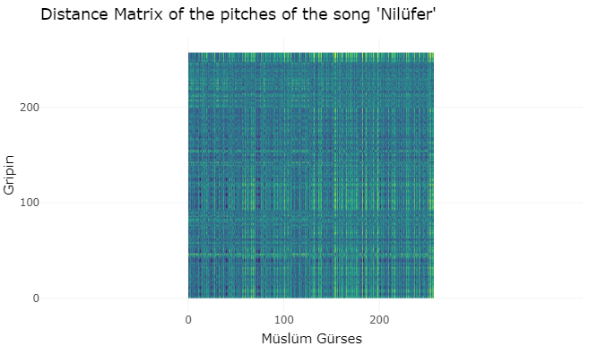

```{r setup, include=FALSE}
library(flexdashboard)
library(tidyverse)
library(spotifyr)
library(ggplot2)
library(showtext)
library(plotly)
library(compmus)

# getting access to the spotify API
Sys.setenv(SPOTIFY_CLIENT_ID = 'c165e1d0717c4bc1a4b10fad65d016e5')
Sys.setenv(SPOTIFY_CLIENT_SECRET = '7771634e58dd4c379280db7d30afbf25')

access_token <- get_spotify_access_token()

font_add_google("Inter", "Inter")
showtext_auto()

# retrieving the audio features of my corpus
baba <- get_playlist_audio_features("", "37i9dQZF1DX9azIhpBmNbd")
eski <- get_playlist_audio_features("", "12VU80QKYGednqNghHrWNW")
beskr <- get_playlist_audio_features("", "37i9dQZF1DXciCKvzkUxfS")
beskp <- get_playlist_audio_features("", "37i9dQZF1DXduWUvte9ZYi?")

# merging the playlists and other preprocessing
eski <- mutate(eski, playlist_name = "Arabesk")
baba <- mutate(baba, playlist_name = "Arabesk")
merged <- merge(beskr, beskp, all = TRUE)
merged <- merge(merged, baba, all = TRUE)
merged <- merge(merged, eski, all = TRUE)
merged <- merged[,!names(merged) %in% c('playlist_img','playlist_owner_name',
                                        'playlist_owner_id','playlist_id',
                                        'track.id','added_at',
                                        'primary_color','added_by.id',
                                        'added_by.type','added_by.uri',
                                        'added_by.href','added_by.external_urls.spotify',
                                        'track.artists','track.disc_number',
                                        'track.episode','track.is_local',
                                        'is_local','track.href',
                                        'track.preview_url','video_thumbnail.url',
                                        'track.album.type','track.album.uri',
                                        'track.external_ids.isrc','track.external_urls.spotify',
                                        'track.album.external_urls.spotify','track.uri',
                                        'track.track','track.type',
                                        'track.album.href','track.album.id',
                                        'track.album.images','track.album.total_tracks',
                                        'track.track_number','track.available_markets',
                                        'track.album.available_markets')]
knitr::opts_chunk$set(echo = TRUE)
```

#### PLEASE DO NOT SHOW THIS PORTFOLIO IN CLASS

Seni Yazdım
=========================================================

## Column {data-width="600"}

### Plot 1

```{r echo=FALSE}
circshift <- function(v, n) {
  if (n == 0) v else c(tail(v, n), head(v, -n))
}

#      C     C#    D     Eb    E     F     F#    G     Ab    A     Bb    B
major_chord <-
  c(   1,    0,    0,    0,    1,    0,    0,    1,    0,    0,    0,    0)
minor_chord <-
  c(   1,    0,    0,    1,    0,    0,    0,    1,    0,    0,    0,    0)
seventh_chord <-
  c(   1,    0,    0,    0,    1,    0,    0,    1,    0,    0,    1,    0)

major_key <-
  c(6.35, 2.23, 3.48, 2.33, 4.38, 4.09, 2.52, 5.19, 2.39, 3.66, 2.29, 2.88)
minor_key <-
  c(6.33, 2.68, 3.52, 5.38, 2.60, 3.53, 2.54, 4.75, 3.98, 2.69, 3.34, 3.17)

chord_templates <-
  tribble(
    ~name, ~template,
    "Gb:7", circshift(seventh_chord, 6),
    "Gb:maj", circshift(major_chord, 6),
    "Bb:min", circshift(minor_chord, 10),
    "Db:maj", circshift(major_chord, 1),
    "F:min", circshift(minor_chord, 5),
    "Ab:7", circshift(seventh_chord, 8),
    "Ab:maj", circshift(major_chord, 8),
    "C:min", circshift(minor_chord, 0),
    "Eb:7", circshift(seventh_chord, 3),
    "Eb:maj", circshift(major_chord, 3),
    "G:min", circshift(minor_chord, 7),
    "Bb:7", circshift(seventh_chord, 10),
    "Bb:maj", circshift(major_chord, 10),
    "D:min", circshift(minor_chord, 2),
    "F:7", circshift(seventh_chord, 5),
    "F:maj", circshift(major_chord, 5),
    "A:min", circshift(minor_chord, 9),
    "C:7", circshift(seventh_chord, 0),
    "C:maj", circshift(major_chord, 0),
    "E:min", circshift(minor_chord, 4),
    "G:7", circshift(seventh_chord, 7),
    "G:maj", circshift(major_chord, 7),
    "B:min", circshift(minor_chord, 11),
    "D:7", circshift(seventh_chord, 2),
    "D:maj", circshift(major_chord, 2),
    "F#:min", circshift(minor_chord, 6),
    "A:7", circshift(seventh_chord, 9),
    "A:maj", circshift(major_chord, 9),
    "C#:min", circshift(minor_chord, 1),
    "E:7", circshift(seventh_chord, 4),
    "E:maj", circshift(major_chord, 4),
    "G#:min", circshift(minor_chord, 8),
    "B:7", circshift(seventh_chord, 11),
    "B:maj", circshift(major_chord, 11),
    "D#:min", circshift(minor_chord, 3)
  )

key_templates <-
  tribble(
    ~name, ~template,
    "Gb:maj", circshift(major_key, 6),
    "Bb:min", circshift(minor_key, 10),
    "Db:maj", circshift(major_key, 1),
    "F:min", circshift(minor_key, 5),
    "Ab:maj", circshift(major_key, 8),
    "C:min", circshift(minor_key, 0),
    "Eb:maj", circshift(major_key, 3),
    "G:min", circshift(minor_key, 7),
    "Bb:maj", circshift(major_key, 10),
    "D:min", circshift(minor_key, 2),
    "F:maj", circshift(major_key, 5),
    "A:min", circshift(minor_key, 9),
    "C:maj", circshift(major_key, 0),
    "E:min", circshift(minor_key, 4),
    "G:maj", circshift(major_key, 7),
    "B:min", circshift(minor_key, 11),
    "D:maj", circshift(major_key, 2),
    "F#:min", circshift(minor_key, 6),
    "A:maj", circshift(major_key, 9),
    "C#:min", circshift(minor_key, 1),
    "E:maj", circshift(major_key, 4),
    "G#:min", circshift(minor_key, 8),
    "B:maj", circshift(major_key, 11),
    "D#:min", circshift(minor_key, 3)
  )

haydi <-
  get_tidy_audio_analysis("3XTzXWtABSuYqAvOso5YP9") |>
  compmus_align(sections, segments) |>
  select(sections) |>
  unnest(sections) |>
  mutate(
    pitches =
      map(segments,
          compmus_summarise, pitches,
          method = "mean", norm = "manhattan"
      )
  )

haydi2 <- haydi |> 
  compmus_match_pitch_template(
    chord_templates,         # Change to chord_templates if descired
    method = "euclidean",  # Try different distance metrics
    norm = "manhattan"     # Try different norms
  ) |>
  ggplot(
    aes(x = start + duration / 2, width = duration, y = name, fill = d)
  ) +
  geom_tile() +
  scale_fill_viridis_c(guide = "none") +
  theme_minimal() +
  labs(x = "Time (s)", y = "", title = "Chordogram of Seni Yazdım")
ggplotly(haydi2)
```

### More visualisations?

<iframe style="border-radius:12px" src="https://open.spotify.com/embed/track/3XTzXWtABSuYqAvOso5YP9?utm_source=generator&theme=0" width="100%" height="352" frameBorder="0" allowfullscreen="" allow="autoplay; clipboard-write; encrypted-media; fullscreen; picture-in-picture" loading="lazy"></iframe>

## Column {data-width="400"}
***
* Continuing with iconic songs of Müslüm Gürses, this week I made a chordogram of his song 'Seni Yazdım'. Just like Nilüfer, Seni Yazdım is one of Müslüm's biggest hits. However, in contrast to Nilüfer, Seni Yazdım might be more a of a typical arabesk song. First I looked at the keys of the song, but then came to the conclusion that a chordogram gave me more valuable insights about how the song is structured..

* In the graph, the magnitude of a chord is higher when it is more blue instead of yellow. Knowing this, it becomes clear that the most prominent chords in the song are 7th chords. Personally, I think that Seni Yazdım is a song that stands out in Müslüm's discography. It has a unique sound, whilst still staying close to the arabesk genre. This may be due to the 7th chords, which might add some color and richness to the harmonies, but could also be used to create tension if the chord is dominant. When I listen to the song, I get the feeling that the chords fulfill both of those purposes. That tension in particular is something that I feel right before the chorus. Despite all of this, the most important use of these chords is to convey the emotions that the artist feels. The lyrics convey that there is some person that the artist loved and does not see anymore. The chords complement these lyrics well.


Corpus
=========================================================

### A description of my corpus

My corpus consists of playlists made by Spotify that revolve around the arabesk music genre. Arabesk is a popular Turkish music genre that emerged in the 1960s and blends traditional Turkish music with elements of Middle Eastern and Southeast European music.The first playlist consists of Arabesk music that is considered more old-school and classic. It's titled 'Babalar'.The second and third playlists are of subgenres of Arabesk music that emerged decades after Arabesk music arrived. The genres are Arabesk pop and Arabesk rap. Their respective playlists are "Besk Pop" and "Besk Rap".

I chose this corpus, because I don't know enough about this genre and want to learn more. What's interesting about Arabesk is that it has changed tremendously throughout the years.

My main interest of points to compare are how the chosen subgenres are similar or different to classic Arabesk music. It could also be interesting to see the differences between songs from each decade.

I believe that the playlists cover their genres fairly well, as Spotify has created them with the purpose of doing so. A strength would be the variety in artists that are featured in the playlists. A weakness could be the size of the corpus.

A typical Arabesk track could be Unutamadım (Kaç Kadeh Kırıldı) by Müslüm Gürses, due to the melancholic tone of the song. A track that could be quite atypical might be Alev Alev by Hayat, as part of it is in German and does not share the typical sentiment of older Arabesk songs. Thus, it makes sense for it to be in the Besk rap playlist.

As of March 5th 2023, a fourth playlist that consists of more songs was added to the corpus. This playlist has been added with the intent of increasing the amount of older Arabesk music. I wanted to increase the representation of different artists and songs in my corpus. So far it has not affected my results much, so I'm not sure if it was helpful. The playlist was mostly made by someone else, but I added a bit to it myself.

<iframe style="border-radius:12px" src="https://open.spotify.com/embed/playlist/37i9dQZF1DX9azIhpBmNbd?utm_source=generator&amp;theme=0" width="100%" height="176" frameBorder="0" allowfullscreen allow="autoplay; clipboard-write; encrypted-media; fullscreen; picture-in-picture" loading="lazy">

</iframe>

<iframe style="border-radius:12px" src="https://open.spotify.com/embed/playlist/12VU80QKYGednqNghHrWNW?utm_source=generator&amp;theme=0" width="100%" height="176" frameBorder="0" allowfullscreen allow="autoplay; clipboard-write; encrypted-media; fullscreen; picture-in-picture" loading="lazy">

</iframe>

<iframe style="border-radius:12px" src="https://open.spotify.com/embed/playlist/37i9dQZF1DXduWUvte9ZYi?utm_source=generator&amp;theme=0" width="100%" height="176" frameBorder="0" allowfullscreen allow="autoplay; clipboard-write; encrypted-media; fullscreen; picture-in-picture" loading="lazy">

</iframe>

<iframe style="border-radius:12px" src="https://open.spotify.com/embed/playlist/37i9dQZF1DXciCKvzkUxfS?utm_source=generator&amp;theme=0" width="100%" height="176" frameBorder="0" allowfullscreen allow="autoplay; clipboard-write; encrypted-media; fullscreen; picture-in-picture" loading="lazy">

</iframe>

# Acousticness and Danceability {data-navmenu="Visualisations"}

## Column {data-width="600"}

### Plot 1

```{r echo=FALSE}
scatter <- ggplot(merged, aes(danceability, acousticness)) +
  geom_point() +
  # geom_smooth() +
  coord_cartesian(ylim = c(0,1), xlim = c(0,1)) +
  theme_bw() +
  theme(
    text = element_text(family = "Inter"),
    panel.grid.major = element_blank(),
    panel.grid.minor = element_blank()) +
  labs(x = "Danceability", y = "Acousticness", title = "Classic Arabesk is more acoustic and less danceable than the subgenres") +
  facet_wrap(~playlist_name)

ggplotly(scatter)
```

## Column {data-width="400"}

------------------------------------------------------------------------

-   The scatter plot above plots the acousticness of the playlists on the Y-axis and the danceability of the playlists on the X-axis. This is done in three subplots for each of the playlists. When looking at the pattern of the dots, it becomes clear that classic Arabesk music tends to have a lower danceability rating and a higher acousticness rating in comparison to the two subgenres (Arabesk Pop and Arabesk Rap). This shows some of the differences of the more recent music in the subgenres in comparison to the older music.

# Valence {data-navmenu="Visualisations"}

## Column {data-width="650"}

### Plot 1

```{r echo=FALSE}
val <- merged %>%
  group_by(playlist_name) %>%
  summarize(mean_valence = mean(valence)) %>%
  ggplot(aes(playlist_name, mean_valence, fill = playlist_name)) +
    geom_col() +
    geom_text(aes(label=round(mean_valence, 2)), vjust = -0.5) +
    coord_cartesian(ylim = c(0,1)) +
    labs(x = "Playlist", y = " Mean valence", title = "The difference in the valence of the playlists is small") +
    theme_bw() + 
    theme( text = element_text(family = "Inter"),
           legend.position = 'none',
           panel.grid.major = element_blank(),
           panel.grid.minor = element_blank()) +
    scale_y_continuous(breaks=seq(0,1,1))

ggplotly(val, tooltip = "text")
```

## Column {data-width="350"}

------------------------------------------------------------------------

-   The plot above shows the mean valence for each of the playlists used. The difference between the values are actually much smaller than I expected them to be. Prior to this plot, I would have expected the classic Arabesk playlist (Babalar) to have somewhat of a lower valence than the other two playlists. Perhaps the mean was not the best property to take of the valence feature, due to its sensitivity to outliers. For next week I might come back to this with a different approach.

# Popularity {data-navmenu="Visualisations"}

## Column {data-width="500"}

### Plot 1
```{r echo=FALSE}
fig <- plot_ly(y = merged$playlist_name, x = merged$track.popularity, type = "box", color = ~merged$playlist_name)
fig <- fig %>% layout(title = "Older Arabesk music currently is less popular than the subgenres", xaxis = list(title="Track popularity"), yaxis = list(showticklabels=FALSE))

fig
```

### Plot 2
TODO: Maybe give some info about some popular and less popular songs visually

## Column {data-width="500"}

------------------------------------------------------------------------

-   In this plot it the popularity of the tracks in each playlist are used to create boxplots. When comparing the boxplots, it becomes clear that these days the tracks from the older playlist are less popular than the subgenres which consists of newer music. Partially this makes sense, as newer music might be more relevant and perhaps is made to fit an audience of this era. However, I would have expected the "Babalar" playlist to be a bit more popular, because it contains music from artists that are highly respected in Turkey (Such as Müslüm Gürses, Orhan Gencebay and Ferdi Tayfur).

# Nilüfer {data-navmenu="Visualisations"}


## Column {data-width="600"}

### Plot 1



### Plot 2
```{r echo=FALSE}
muslum2 <-
  get_tidy_audio_analysis("4cHrCNJTdMfbtY0fjc5ged") |> # Change URI.
  compmus_align(bars, segments) |>                     # Change `bars`
  select(bars) |>                                      #   in all three
  unnest(bars) |>                                      #   of these lines.
  mutate(
    pitches =
      map(segments,
          compmus_summarise, pitches,
          method = "rms", norm = "euclidean"              # Change summary & norm.
      )
  ) |>
  mutate(
    timbre =
      map(segments,
          compmus_summarise, timbre,
          method = "rms", norm = "euclidean"              # Change summary & norm.
      )
  )
timb <- muslum2 |>
  compmus_self_similarity(timbre, "cosine") |> 
  ggplot(
    aes(
      x = xstart + xduration / 2,
      width = xduration,
      y = ystart + yduration / 2,
      height = yduration,
      fill = d
    )
  ) +
  geom_tile() +
  coord_fixed() +
  scale_fill_viridis_c(guide = "none") +
  theme_classic() +
  labs(title = "Self similarity Matrix of the timbre of Müslüm\'s Nilüfer") +
  labs(x = "", y = "")

ggplotly(timb)
```
## Column {data-width="400"}
***
* NOTE: For some reason this first plot caused my html file to be over 100mb, which Github did not like. So for now I just uploaded an image instead of using my R. Next week I'll try to find a fix.

* In the first plot we see a distance matrix of the pitches of the song "Nilüfer", performed originally by Müslüm Gürses in 2006. 15 years later, Rock band Gripin released their own version of this song. Even though, Gripin's variant of this song is not in my corpus, I felt like it would be interesting to make this distance matrix between these two recordings. Müslüm Gürses is one of the biggest names in the arabesk genre and his song "Nilüfer" is one of his biggest hits, despite it being one of his later releases. Personally, I listen to the original more often than I listen to Gripin's verison, but I do not mind Gripin's version of the song either. Other interesting distance matrices could be made with other songs that came from the 2006 album "Aşk Tesadüfleri Sever", as it contains a lot of songs of which instrumentals are taken from popular non-Turkish music. Nilüfer is not one of those songs. Now to get to my actual analysis of the matrix, I struggle to see a cost-minimizing alignment path that could be created through dynamic time warping. This could be a fun task for next week. Initially, I expected the songs to have some differences in their pitches, but I'm not entirely sure if my matrix confirms or denies this.

* In the second plot a self similarity matrix of the timbre of Müslüm's Nilüfer can be seen. Generally, to me it seems like the distances between timbre at different moments are not very large. This would suggest that this song in particular has some structure to it. I also wanted to plot a chroma-based self-similarity matrix in this position, but could not get it to work. For next week, I should look at implementing subplots to make this work.

Conclusion
========================================================================

I think I need to explore my corpus a bit more and gain more insights from it before I can draw definitive conclusions.
